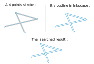

# SVG_SandDrawing
SVG_SandDrawing is java tool that allows to make a particular shape from an SVG stroke : 

when you use a stick to draw in the sand, if the path you follow cross itself, the resulting shape will cut itself  
the problem is in most svg editing software such as Inkscape, even if the path cross over itself, you get the outline of everything.

This is different : if the path cross itself, the resulting outline will subtract its previous "Area" to get a knot or sand drawing effect

example :

